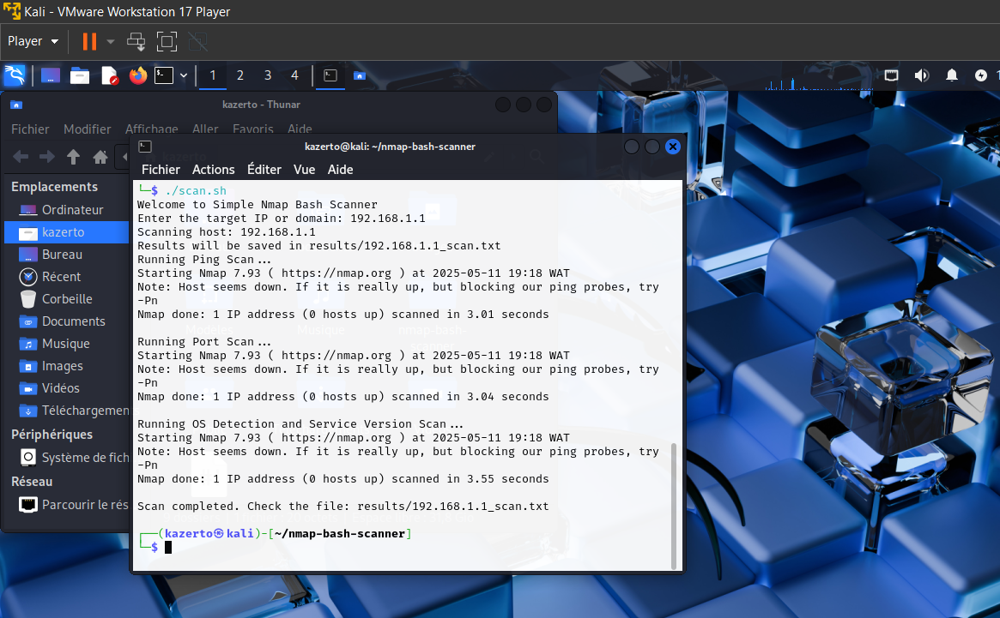

# nmap-bash-scanner
Bootcamp HAck me

## Description
Un outil simple pour effectuer une reconnaissance réseau automatisée en utilisant Nmap et Bash.

## Fonctionnalités
- Scan Ping pour vérifier si un hôte est actif
- Scan complet des ports ouverts
- Détection du système d'exploitation et des versions de services
- Sauvegarde automatique des résultats dans un dossier `results/`

## Utilisation
1. Assurez-vous que Nmap est installé (`sudo apt install nmap` sur Linux).
2. Rendez le script exécutable :
   ```bash
   chmod +x scan.sh



